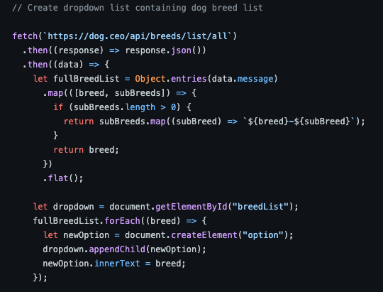
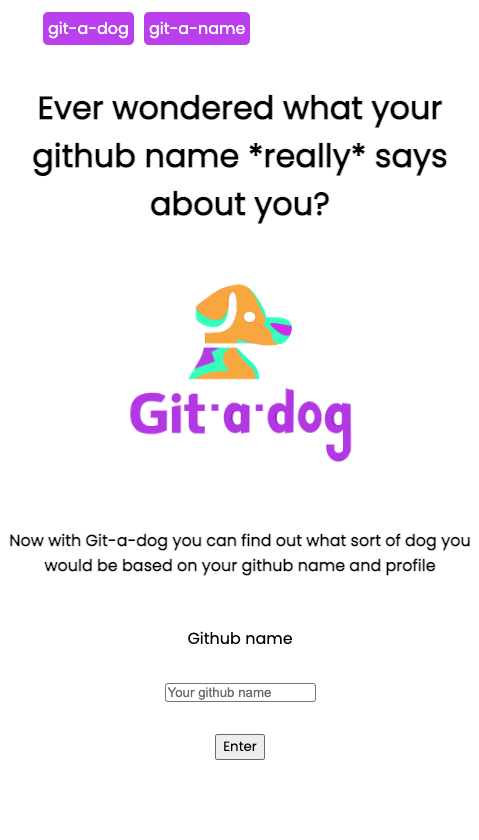
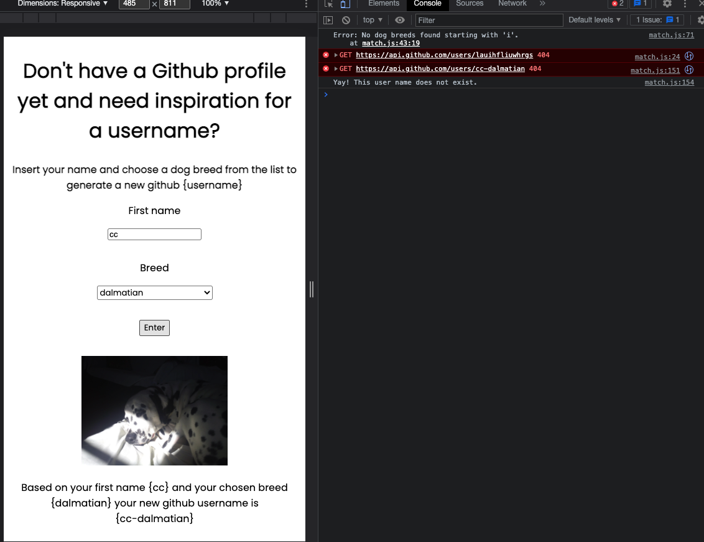

## 1. Write code that executes asynchronously
For the HTTP project, we were tasked with learning how to use two APIs using fetch and write asynchronous code. 
 
The below screenshot shows a function that gets a list of breeds from a dog API that we later then use to match with github user names using Github's API.
 

## 2. Use callbacks to access values that aren’t available synchronously
With the above, we use it as a callback in a function later on when sorting through a list of breed names.
 

## 3. Use promises to access values that aren’t available synchronously
During this section of the skills bootcamp, we were working on Execute Programmes' course on concurrency which has a very different interface for using promises. Because of this, it definitely made us question if we were using promises correctly as our code didn't look the same as it did on the programme. 

## 4. Use the fetch method to make HTTP requests and receive responses
We used the fetch method to get the initial list of dog breeds and images. We then used the fetch method to check if specific github usernames existed to cross reference them against the list of dog breeds.  

## 5. Configure the options argument of the fetch method to make GET and POST requests

## 6. Use the map array method to create a new array containing new values
We used map to reshape the list of dog breeds so that we could use them in a drop down further down the page when a user can create a new github username.
 

## 7. Use the filter array method to create a new array with certain values removed
We used the filter method to match github usernames to a breed based on the first character of the string.
 

## 8. Access DOM nodes using a variety of selectors
We used many different ways of selecting dom nodes in order to add and remove information off of the page. However, we definitely had a preference for 'getElementbyId'

## 9. Add and remove DOM nodes to change the content on the page
As with the above, we used getElementById to access the majority of nodes, createElement and innerText to add nodes to the page.

## 10. Toggle the classes applied to DOM nodes to change their CSS properties
We relied on CSS for this and didn't toggle classes using the DOM. However, if we had we would have used setAttribute to make this happen. 

## 11. Use consistent layout and spacing
For this project we focussed more on trying to learn about promises and leaned on the learning outcomes to guide us. We did not spend a bulk of time on the layout but we tried to use a wireframe ahead of time in order to have a clear picture of what we wanted to end up with at the end. 
 

## 12. Follow a spacing guideline to give our app a consistent feel
My working partner added in stacks in CSS to make sure that spacing was even throughout the page. 
## 13. Debug client side JS in our web browser
## 14. Use console.log() to help us debug our code
While working on this project we continually used console.log() and catches to help us debug our code. 
 
