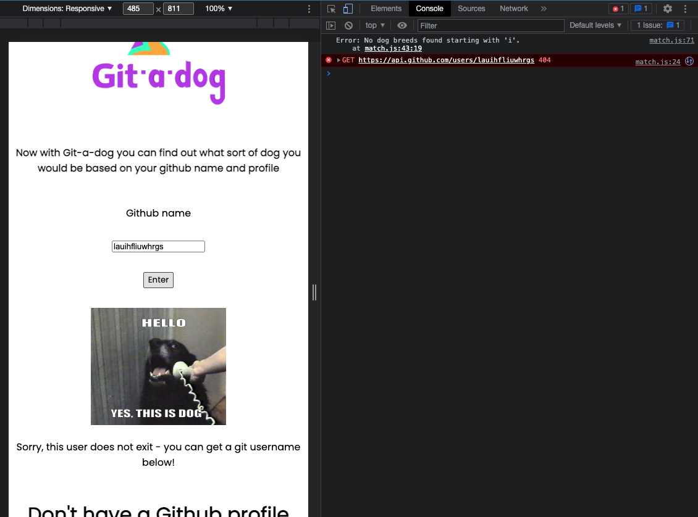

## 1. Write code that executes asynchronously
For the HTTP project, we were tasked with learning how to use two APIs using fetch and write asynchronous code. 
 
The below screenshot shows a function that gets a list of breeds from a dog API that we later then use to match with github user names using Github's API.

## 2. Use callbacks to access values that aren’t available synchronously

## 3. Use promises to access values that aren’t available synchronously

## 4. Use the fetch method to make HTTP requests and receive responses

## 5. Configure the options argument of the fetch method to make GET and POST requests

## 6. Use the map array method to create a new array containing new values

## 7. Use the filter array method to create a new array with certain values removed

## 8. Access DOM nodes using a variety of selectors

## 9. Add and remove DOM nodes to change the content on the page

## 10. Toggle the classes applied to DOM nodes to change their CSS properties

## 11. Use consistent layout and spacing

## 12. Follow a spacing guideline to give our app a consistent feel

## 13. Debug client side JS in our web browser

## 14. Use console.log() to help us debug our code
