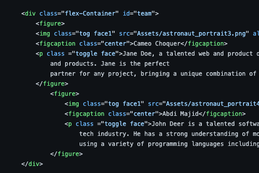
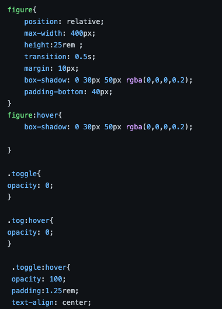
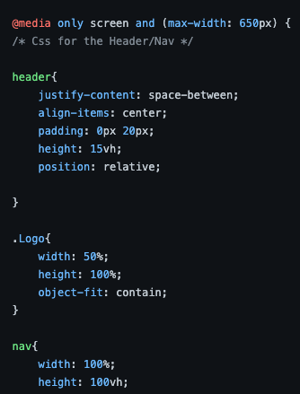
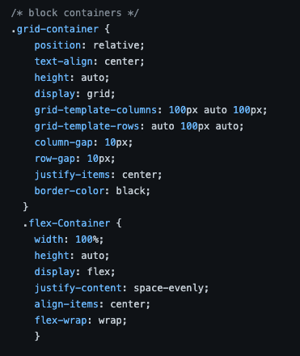
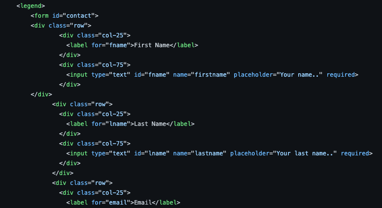

## 1. Structure a site using semantic HTML to aid accessibility

 
The above screenshot shows a small part of our project website where we used semantic HTML. We also edited html so that cards could be tabbed through and that all images had alt text and captions where appropriate.
## 2. Ensure a web page is readable for screen readers

My partner on the project did a great job making sure that screenreaders could get through the site's menu and navigate through the page. We had some elements that would appear/disappear on interaction. We avoided using 'display none' resorting to using opacity and hover so that this could still be picked up by users. 
## 3. Ensure our UI has sufficient colour contrast so that everyone can perceive it comfortably

 
We used bright colours and had an image which made it difficult to get the right contrast so that people could read the hero section comfortably. We used lighthouse to test for accessibility to ensure it was up to standard. 

## 4. Use various tools to check that our website meets accessibility criteria
We relied on lighthouse and our computers default screenreaders to test for accessibility of which we received 100%. 
## 5. Use CSS media queries to ensure our content is always presented effectively on screens of different sizes

 
We used media queries with mobile-first in mind. We also ensured that the site could be seen on larger screens as well. 

## 6. Demonstrate a mobile-first approach to building a website
As above, we relied on media queries to ensure it scaled well. However, we also used flexbox to make sure that elements would organise themselves in a column layout on mobile. 
## 7. Use CSS variables to apply repeated colours to HTML elements

## 8. Use CSS Flexbox to style children in a single-direction layout (ie a row or a column)

 
Both of us were used to using flexbox and so using grid felt like more of a stretch - which made it all the more important to use it in our first project. 

## 9. Use CSS Grid to style children in two-direction layout

## 10. Ensure our Git commit history tells a coherent story

## 11. Use the appropriate input types in HTML forms for gathering different types of information

 
We use appropriate form inputs and required fields to nudge users to use the correct formats. 
We also created an alert to notify the user that they had infact submited the form. 
At the end of the project, we also added in a feature to save the contact information to local storage.